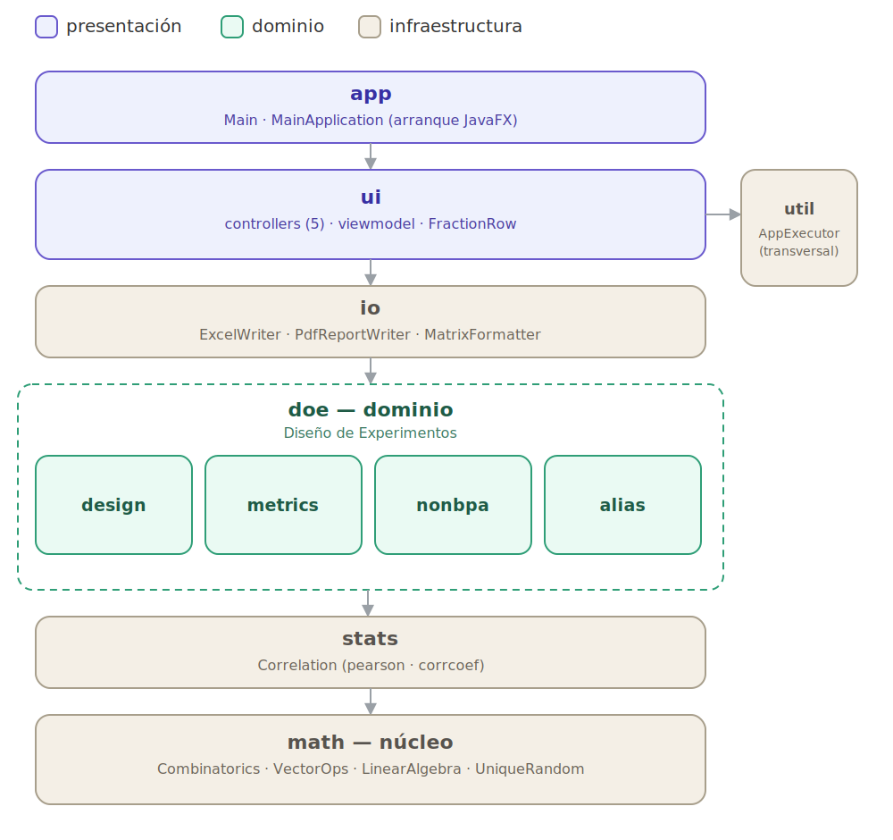

# NOBAITC — Reestructuración del proyecto

Documento de migración de la refactorización completa (fases 1–4) y de la
revisión de la estructura de alias.

## 0. Arquitectura



## 1. Estructura nueva de paquetes

```
me.julionxn.nobaitc
├── app/            Punto de entrada (Main, MainApplication)
├── math/           Álgebra y combinatoria puras (sin dependencias externas)
│   ├── Combinatorics        gcd, lcm, nchoosek
│   ├── VectorOps            media, suma, max, argmax, find, desv. estándar…
│   ├── LinearAlgebra        transpose, inv (Gauss-Jordan), diag, tril…
│   ├── SingularMatrixException
│   └── UniqueRandom         muestreo aleatorio sin repetición
├── stats/
│   └── Correlation          pearson, corrcoef
├── doe/            Dominio: Diseño de Experimentos
│   ├── design/
│   │   ├── Design           value object + validación + parámetros
│   │   └── FractionExtractor (Factory) extracción por aritmética modular
│   ├── metrics/    Métricas (Strategy)
│   │   ├── FractionMetric   interfaz
│   │   ├── GbmMetric · J2Metric · VifsMetric
│   ├── nonbpa/
│   │   ├── Fraction         modelo de dominio PURO (sin JavaFX)
│   │   └── NonbpaGenerator  orquestador
│   └── alias/
│       ├── EffectLabeler    etiquetas de efectos (A, B, A-B…)
│       ├── ModelMatrixBuilder  matriz de efectos (principales/dobles/triples)
│       ├── AliasAnalyzer    algoritmo de alias (pasos 4 y 5)
│       └── AliasStructure   resultado (API estable, sin Lombok)
├── io/             Entrada/Salida
│   ├── MatrixFormatter      ÚNICO punto de serialización de matrices a texto
│   ├── ExcelWriter · PdfReportWriter · ClipboardHelper
├── ui/             Capa de presentación (JavaFX)
│   ├── controllers/         los 5 controladores
│   └── viewmodel/
│       └── FractionRow      adaptador JavaFX que envuelve a Fraction
└── util/
    └── AppExecutor          ejecución en segundo plano (Task)
```

## 2. Correspondencia con el proyecto anterior

| Antes | Ahora |
|---|---|
| `MatlabFunctions` (God Object, 457 líneas) | `math/Combinatorics`, `math/VectorOps`, `math/LinearAlgebra`, `math/UniqueRandom`, `stats/Correlation` |
| `NONBPAGeneratorService` | `doe/nonbpa/NonbpaGenerator` + `doe/design/Design` + `doe/design/FractionExtractor` |
| `BalancedGBMMatrix`, `OrthogonalJ2Matrix`, `VIFSMatrix` | `doe/metrics/GbmMetric`, `J2Metric`, `VifsMetric` (Strategy) |
| `FractionResult` (dominio + JavaFX mezclados) | `doe/nonbpa/Fraction` (dominio puro) + `ui/viewmodel/FractionRow` (vista) |
| `AliasStructureGenerator` | `doe/alias/AliasAnalyzer` + `EffectLabeler` + `ModelMatrixBuilder` |
| `AliasStructure` (con Lombok) | `doe/alias/AliasStructure` (getters explícitos, sin Lombok) |
| `FormatHelper` | `io/MatrixFormatter` |
| `controllers/*` | `ui/controllers/*` |
| `Main`, `MainApplication` | `app/*` |

## 3. Patrones y mejoras aplicadas

- **God Object eliminado**: `MatlabFunctions` se dividió por responsabilidad.
- **Strategy** en métricas: añadir una métrica nueva = una clase que implemente
  `FractionMetric`, sin tocar `NonbpaGenerator`.
- **Factory** (`FractionExtractor`): única forma de construir fracciones.
- **Value Object** (`Design`, `Fraction`): inmutables, testeables.
- **Dominio desacoplado de la UI**: `Fraction` no depende de JavaFX; toda la
  parte JavaFX vive en `FractionRow`. Los nombres de propiedad coinciden con los
  que usaba `PropertyValueFactory`, por lo que la tabla no requirió cambios de
  binding.
- **Manejo de errores unificado**: `inv()` ahora lanza `SingularMatrixException`
  en lugar de devolver `null`.
- **Serialización única**: las 3 copias de formateo de matrices (FormatHelper,
  ExcelWriter, PdfReportWriter) se unificaron en `MatrixFormatter`.
- **Código muerto eliminado** de la generación NONBPA (matriz refleja:
  `buildReflexMatrix`, `createReflexMatrix`, `generateMainEffectsMatrix`,
  `fillFactorColumn`, `extractFraction`).
- **Logs de depuración eliminados** (`System.out.println` / `printMatrix`) del
  algoritmo de alias.

## 4. Revisión de la estructura de alias

Se conservó el algoritmo numérico (portado de `PASO4.m` / `PASO5.m`) **idéntico**
para no alterar resultados ya validados. Hallazgos:

1. **NaN por columnas constantes (CORREGIDO).** Cuando un efecto queda
   perfectamente confundido, su columna del modelo es constante (varianza 0) y
   `corrcoef` devuelve `NaN`. Antes ese `NaN` se filtraba hasta el mapa de alias
   y aparecía como `"NaN A-B-C"`. Se sanea a 0 en la entrada del paso 4. Los
   diseños sin columnas constantes **no cambian** (no tienen NaN). Verificado.

2. **Guard inerte (DOCUMENTADO, comportamiento preservado).** El mensaje de
   error habla de efectos principales "fuertemente correlacionados (r>0.5)", pero
   el umbral real es `1.5`, inalcanzable para una correlación normalizada en
   [-1, 1]: la validación nunca se dispara con datos reales. Se conserva el valor
   original (`STRONG_CORRELATION_THRESHOLD = 1.5`) pero ahora es una constante
   nombrada y documentada en `AliasAnalyzer`, lista para ajustarse con criterio
   estadístico si se confirma que debía ser efectiva.

3. **Limitación de confusiones perfectas (DOCUMENTADO).** Una correlación
   `|r| = 1` se trata como diagonal y se elimina, por lo que el algoritmo sólo
   detecta correlaciones **parciales** (`VL < |r| < 1`). Esto es correcto para las
   fracciones NONBPA no regulares para las que sirve la herramienta; los diseños
   regulares con confusión exacta quedan fuera de su alcance.

4. **Cálculo de Q (preservado).** El Java excluye `|T| ≈ 1` en ambos signos,
   mientras el MATLAB excluía sólo `T ≈ +1`. Es un caso borde con correlaciones
   perfectas; se conserva el comportamiento del Java (más defensivo).

## 5. Qué está verificado y qué falta confirmar

Aquí **no hay acceso a Maven Central**, así que no se pudieron descargar
JavaFX / Apache POI / iText / controlsfx para compilar la capa UI/IO.

- **Capa pura (math, stats, doe, io/MatrixFormatter): COMPILADA y PROBADA aquí.**
  Se compiló con `javac 21` y se ejecutó una batería de pruebas: **29/29 OK**,
  más una prueba end-to-end (generar fracción NONBPA real → analizar alias) sin
  NaN y con la matriz MSZ cuadrada. Esto cubre toda la matemática y la revisión
  de alias.
- **Capa UI/IO (controllers, viewmodel, io/writers, app): refactorizada** con
  cambios de tipo/import casi mecánicos, manteniendo APIs compatibles. No se pudo
  compilar aquí por falta de las dependencias; **confírmala en tu equipo** con:

```bash
mvn clean javafx:run
```

(o `mvn -q clean compile` solo para compilar). Tu equipo sí tiene las
dependencias en el `pom.xml`, por lo que la compilación debería completarse.

## 6. Notas

- Se eliminó `requires static lombok;` del `module-info` porque ninguna clase usa
  ya Lombok (sólo lo usaba `AliasStructure`).
- La carga de recursos (`MainApplication.getResourceURL`) ahora usa una ruta
  absoluta del classpath (`/me/julionxn/nobaitc/…`), robusta al cambio de paquete.
- El `mainClass` del `pom.xml` se actualizó a `me.julionxn.nobaitc.app.Main`.
